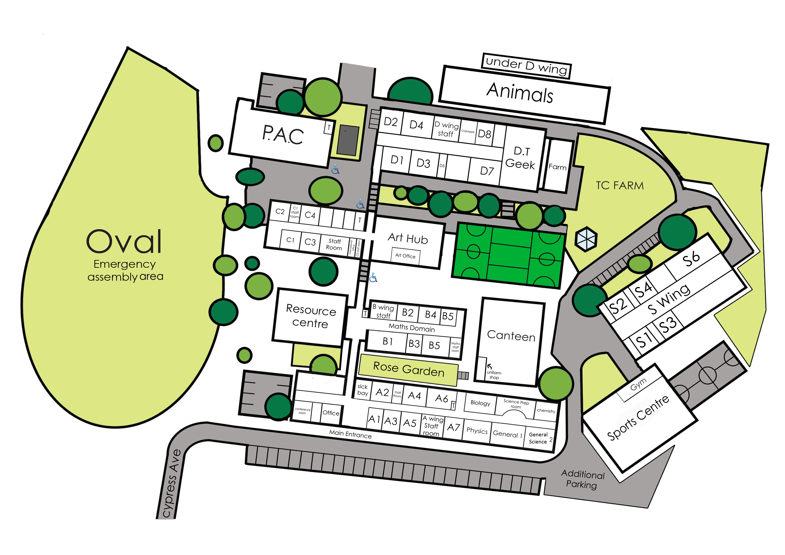

#MissMakesCode is almost here and before the day we wanted to let you know a few things.

**On arrival 9.00 am**  
Guardians and their MissMakers should arrive at the main entrance of Templestowe College, 7 Cypress Ave, Templestowe Lower VIC 3107 and head to B Block where there will be a registration desk at the turn off from the main corridor. Please register here for the day.

**Car Parking**  
There is ample car parking at the front of the school. Enter via Cypress Ave.

**What to bring**  
In a small backpack:

- iPad and charger (ensure to have removed any restrictions on the iPad that prevent access to wifi, internet, use of camera and microphone)
- recess and lunch
- drink bottle

Backpacks and all items should be labelled with your MissMakers name and will be stored in the classrooms that are being used for the day so they are easily accessible.

**Supervision**  
All MissMakers will be supervised for the duration of the day by the staff delivering the workshops. The teachers all have current VIT registration and training in basic first aid.

In addition, there are a number of student helpers and other staff assisting. Templestowe College compiles with OHS regulations and has met duty of care and risk management requirements for this event.

First Aid is onsite and an ambulance will be called for any MissMaker who requires medical attention of that nature. Parents will also be contacted on the contact details already provided.

**Medical Alerts**  
Please contact us via email if you need us to know of any medical alerts for your daughter including anaphylaxis, asthma or any other allergies. If there is any another information that is important please email prior to Thursday 22 September so that are aware. If needed we will make contact with you to discuss before the day,

**Permission for Photos and Publications**  
Please contact us by email if you do not give permission for your daughter to be in photos or video footage that will be filmed on the day and used for publications by Girl Geek Academy and/or Templestowe College. There will be a photographer and videographer present on the day.

**Pick up at 3.30pm**  
Parents should enter the main entrance of Templestowe College and head to B Block where they registered that morning. Continue through the corridor to the Maths Block to collect your daughter.

Thanks for helping us MissMakesCode one of the best learning events for young girls ages 5-8!
