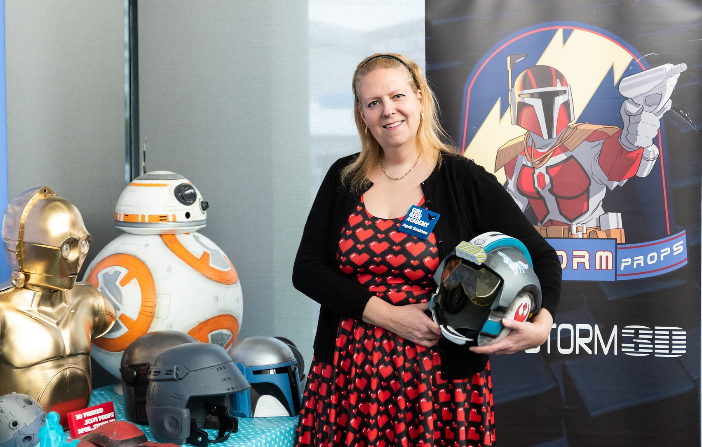
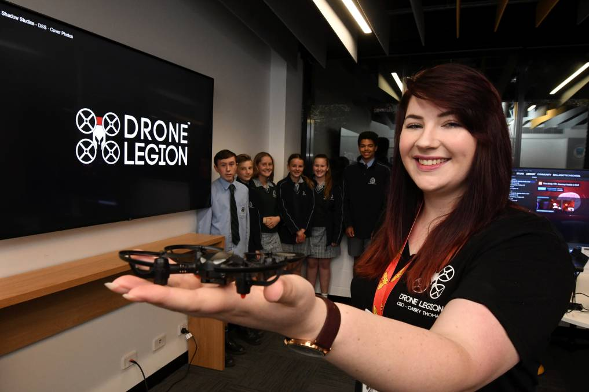

## Increasing the number of women in Drones, Aviation and Space. Established 2019.

She Flies is Girl Geek Academy’s initiative to increase women representation, capacity, and cooperation in the fabulous fields of drones, space and aviation.
In Australia, women make up fewer than 1% of drone pilots. In the UK it's around 3% and the USA 4% of drone pilots that are women.
This suite of programs was created to inspire and provide a platform for change to occur.

### Getting girls into space

Girl Geek Academy cofounder April Staines was a geek before it was even a thing. April runs her own business, April Storm Props, dedicated to making digitally fabricated and 3D printed costume props for the fan, collector and cosplay community.
April recently co-authored the fourth book in the Girl Geeks series, Making Magic, to inspire young girls to explore what’s possible in space. The book is about the school play “SPACETACULAR” and the Girl Geeks make space props to get the play into orbit.

### Virtual reality drone racing

Dark Shadows CEO Casey Thomas created the game Drone Legion – The game is an interactive virtual reality (VR) drone racing simulator, based on the increasingly popular sport of drone racing, which involves tiny quadcopters with cameras racing around courses and obstacles at speeds up to 150km/h. Spectacular crashes are common. The game has been featured by the AFL at an esport mini tournaments, the Melbourne Open tournament and many other sporting events.

