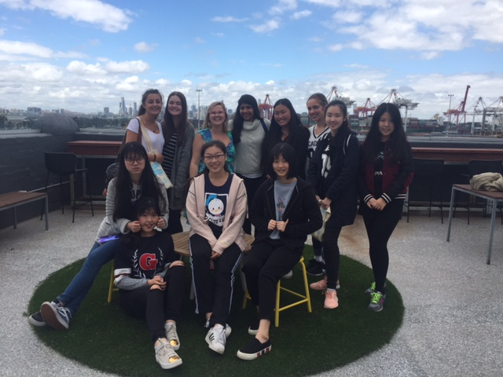

If we want to see more girls building startups and pursuing careers in technology, we have to make it an attractive career choice as early in their lives as possible.

Today Girl Geek Academy hosted eleven young women from Korowa Girls School in a career and workplace immersion day. One of four around the city, these young women were interested in STEM careers but were also inspired greatly by the idea of a magical place where their dreams could come true.

Lucky for us The Dream Factory owners, [Impact Investment Group](http://www.impact-group.com.au/), were in the building and Caroline Vu, Chief Impact Officer, stopped by to share the vision of the Dream Factory and why IIG have invested in the space. She also shared IIG’s business philosophy of combining the best of both capital and values-based investment principles to create a triple bottom line – good financial, social and environmental returns.

Each young woman then shared their dreams with the group and explored how technology would bring each of those dreams to life. The team then explored whether they identified as a “hacker”, “hustler” or “hipster” and quickly discovered most people are a bit of all three. We then discussed how young people can be enabled to make their dreams come true through entrepreneurship and I spoke about how we run #SheHacks as a way for women to build businesses together.

Rahul Soans, [Inspire9](http://inspire9.com/) Community Manager, and [Mark Balla](http://inspire9.com/about), CEO of Inspire9, welcomed the young women to the community and explained a bit about how a coworking space operates, who works there and why. They also shared their personal journeys from being engineers to leading a community of makers, tech startups and emerging businesses at Inspire9.

We then kicked off a tour of the building by exploring the area where the [virtual reality space](http://snobal.io/virtual-reality-lab-inspire9-dream-factory/) will be, taking a walkthrough of the Fab9 makerspace area and also hunted for the newly installed Tesla batteries that will power the building making it “off the grid”.

[Ann Nolan](https://www.linkedin.com/in/annnolan) from [Snobal](http://snobal.io/) kindly shared with us her journey from being a psychologist to the leader of a VR company and showcased her company’s latest program that teaches people how to use virtual reality for the first time. The young women got hands on with a program created by Snobal using the HTC Vive set up in the space.

Finally we had a visit from the team at [Engineers Without Borders](https://www.ewb.org.au/) who shared some of the work their organisation achieves around the world. They also gave us some goodie bags to take home from Engineers Without Borders annual event [Link Festival](http://www.linkfestival.com.au/about/), the premier event for people who are passionate about design, technology and social change.

In a short space of time these amazing young women were exposed to a vast array of emerging technology and the career possibilities open to them. If you would like to learn more about how Girl Geek Academy can work with you to bring your dreams to life, just email me sarah@girlgeekacademy.com

