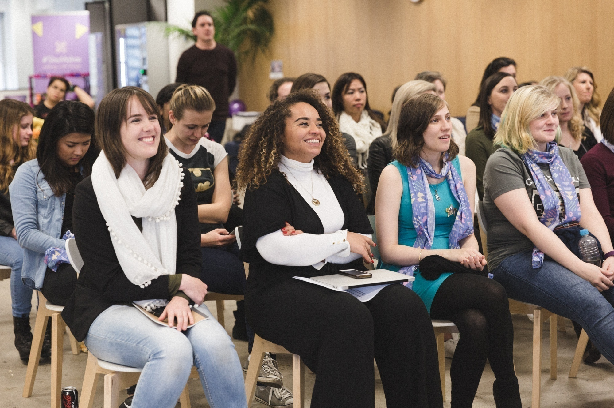

  
Do you know some amazing women in your workplace, but rarely get the chance to work with them directly? #SheHacks is happening July 14-16, and you’re invited to make the most of this unique professional development experience – [shehacks.com.au](http://shehacks.com.au/)

We’re pleased to announce that we’ve introduced a first of its kind corporate program into our #SheHacks initiative, aiming to help companies connect women who may work across different departments and boost the camaraderie of their female employees.

Interested to learn more? Check out our **media release** below. Or just sign up and see

**Australia, 9 June 2017:** Australia’s[Girl Geek Academy](https://girlgeekacademy.com/) has announced a **first of its kind corporate program** for its [#SheHacks](https://shehacks.com.au/) initiative – the world’s largest all-women hackathon dedicated to bringing women together and creating more technology businesses in the state.

Ten Australian corporates now have the opportunity to submit a team of three women from across their organisation: one *hacker*, one *hustler*, and one *hipster* – providing corporates with the opportunity to connect women who may work across different departments and increase the camaraderie of their female employees.

**Sarah Moran, Co-founder and CEO of Girl Geek Academy said:** “Women techies can often be hugely underrepresented within corporate Australia’s technology departments. #SheHacks will help connect these women with other female colleagues across the business – perhaps a talented marketer and salesperson – helping to boost corporate morale while generating a sense of intrapreneurship to take back to their organisation.”

Last year’s #SheHacks event trialled the corporate initiative with a team from Deloitte. The success of the pilot inspired Girl Geek Academy to open up the opportunity to ten corporate teams in 2017.

**Peter Williams, CEO, Deloitte – Centre for the Edge, said:**“Deloitte has sponsored this event as it fits squarely with our values of diversity, empowerment of women and innovation. #SheHacks has given women in our teams the opportunity to showcase both internally and externally what they are capable of.”

This year #SheHacks will see over 200 women come together at Melbourne’s The Dream Factory on July 14-16. The event will only be accepting ten corporate teams, each provided with their own office space to brand with company visuals for the weekend experience. The corporate event package includes pre-event online training, the weekend event (including all catering and activities), professional photography of teams at the event, and eight weeks of mentoring after the event to ensure the teams succeed.

Much more than a weekend event, #SheHacks is dedicated to sustaining the outcomes of the hackathon with various touchpoints throughout the year. Pre-event bootcamps have taken place across Melbourne City and the regional suburbs of Warragul, Warnambool and Bendigo, to prepare women for the main hackathon weekend. Following this, a dedicated program designed to support participants in further developing their MVP will be actioned to ensure tangible outcomes.

Ms Moran continued: “#SheHacks is unlike regular hackathons as it starts with an assembled team rather than team recruitment based on pitches. This year’s event will host university teams and individual teams, alongside the ten corporate teams. The initiative will showcase Victoria as the best place in the world for a woman to join a startup.”

The #SheHacks program initially launched as a highly successful pilot in 2014, at the Inspire9 co-working facility in Victoria. #SheHacks will be the first statewide program at large scale.

For more information please visit: [https://shehacks.com.au](https://shehacks.com.au/).
